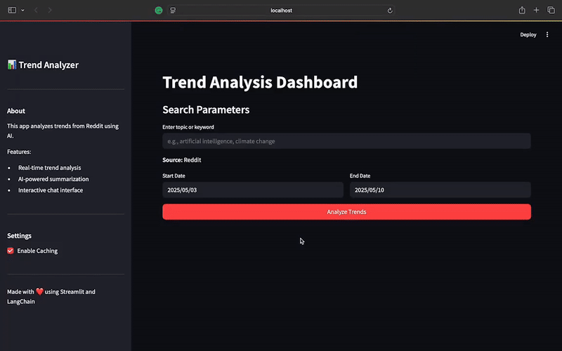

# Trend Analyzer

An application that analyzes trends and provides AI-powered insights using LLM. This project demonstrates a practical implementation of LLM using LangChain.



## Features

- AI-powered text processing and analysis
- Interactive chat interface for asking questions
- Source citations with detailed metadata
- Caching system for improved performance
- Vector storage for efficient data retrieval
- LangChain integration for advanced LLM operations
- Dynamic word cloud visualization based on retrieved content

## Technologies & Tools Used

- **LangChain**: For building LLM-powered applications and managing complex chains of operations
- **Vector Databases**: For efficient storage and retrieval of embeddings
- **Streamlit**: For creating an interactive and responsive web interface
- **WordCloud**: For generating dynamic word visualizations

## Setup

1. Clone the repository:
```bash
git clone https://github.com/mortezagolzan/Trend_Analyzer.git
cd Trend_Analyzer
```

2. Install dependencies using Pipenv:
```bash
pipenv install
```

3. Create a `.env` file in the project root with your API keys:
```
OPENAI_API_KEY=your_openai_api_key_here
REDDIT_CLIENT_ID=*
REDDIT_CLIENT_SECRET=*
REDDIT_USER_AGENT=*
```

4. Run the application:
```bash
pipenv run streamlit run app.py
```

## Project Structure

```
trend_analyzer/
├── app.py              # Main Streamlit application
├── core/              # Core functionality and business logic
├── scrapers/          # Data collection modules
├── data/              # Data storage and processing
│   └── .gif file     # demo
├── requirements.txt   # Project dependencies
└── README.md         # Project documentation
```


## Contributing

Contributions are welcome! Please feel free to submit a Pull Request.

## License

This project is licensed under the MIT License - see the LICENSE file for details. 
